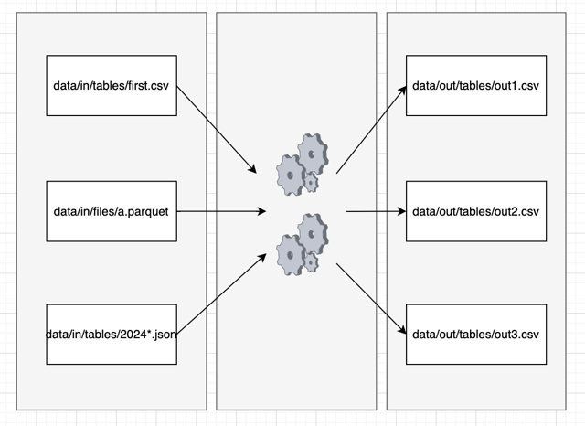

# DuckDB Processor

The DuckDB processor is a component that allows running SQL queries on the DuckDB database. For more information about DuckDB, please visit the [DuckDB Docs website](https://duckdb.org/docs/).

## Configuration

The component supports two **modes of operation**:
- Simple (default)
- Advanced

### Simple Mode
In simple mode, each query operates on a single table in DuckDB that can be created from a table defined by name, or from multiple tables matching a pattern (along with an arbitrary number of files). 
The query output is exported using the name of the input table.

In simple mode, the parameter **queries** is an array of queries to be executed. Each query has own input, query, and output, and is isolated.
Each query can use the following parameters:

- **input:** A string specifying the name of table or an object containing the following parameters:
  - **input_pattern** (required): The name of the table or [glob pattern](https://duckdb.org/docs/data/multiple_files/overview#glob-syntax)
  - **duckdb_destination:** (required when glob pattern used in the previous param) The name of the table in DuckDB
  - **dtypes_mode:** all_varchar (default) / auto_detect / from_manifest
    - all_varchar: Treats all columns as text
    - auto_detect: Automatically infers data types
    - from_manifest: Uses data types from the input manifest (if a wildcard is used, the manifest of the first table is used)
  - **skip_lines:** The number of lines to skip
  - **delimiter:** A string specifying the delimiter
  - **quotechar:** A string specifying the quote character
  - **column_names:** A list of column names
  - **date_format:** A string specifying the date format
  - **timestamp_format:** A string specifying the timestamp format
  - **add_filename_column:** A boolean value indicating whether the filename should be added as a column
- **query** (required): The query to be executed
- **output:** A string specifying the output table name or an object containing the following parameters:
  - **kbc_destination:** The name of the output table
  - **primary_key:** A list of primary keys
  - **incremental:** A boolean value indicating whether the data should be loaded incrementally

### Advanced Mode

In advanced mode, the [relations](https://duckdb.org/docs/api/python/relational_api) from all specified input tables are created first.
Then, all defined queries are processed. Finally, output tables specified in out_tables are exported to Keboola Storage.

Parameters:
 - **input:** An array of all input tables from Keboola, defined either as a string containing the name, or as an object containing the following parameters:
    - **input_pattern** (required): The name of the table or [glob pattern](https://duckdb.org/docs/data/multiple_files/overview#glob-syntax)
    - **duckdb_destination:** (required when glob pattern used in the previous param) The name of the table in DuckDB
    - **dtypes_mode:** all_varchar (default) / auto_detect / from_manifest 
      - all_varchar: Treats all columns as text
      - auto_detect: Automatically infers data types
      - from_manifest: Uses data types from the input manifest (if a wildcard is used, the manifest of the first table is used)
    - **skip_lines:** The number of lines to skip
    - **delimiter:** A string specifying the delimiter
    - **quotechar:** A string specifying the quote character
    - **column_names:** A list of column names
    - **date_format:** A string specifying the date format
    - **timestamp_format:** A string specifying the timestamp format
    - **add_filename_column:** A boolean value indicating whether the filename should be added as a column
- **queries:** A list of SQL queries to be executed
- **output:** An array of all output tables, defined as a string specifying the output table name or as an object containing the following parameters:
  - **kbc_destination:** The name of the output table
  - **primary_key:** A list of primary keys
  - **incremental:** A boolean value indicating whether the data should be loaded incrementally

Examples of configurations for both modes can be found in the [README.md](../README.md) or in the [tests](../tests/).